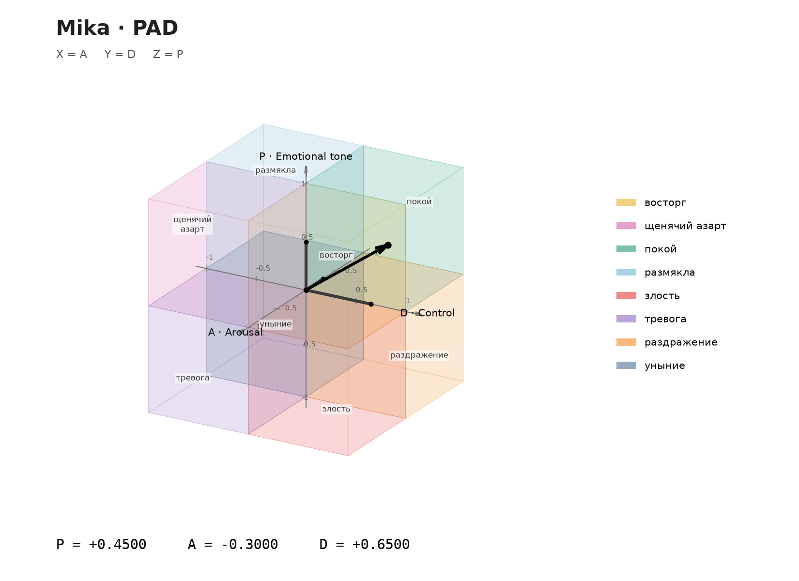

# PAD visualization in the state topic

The ops bot maintains one pinned photo in `topics.state` (1266 in this
installation). The existing caption continues to show the current activity,
place, verbal mood, health and finances. `/state` exports the full world snapshot,
including resources, calendars and plans, alongside the existing learner status.
There is no additional automatic chart explanation message.



## Geometry

- X is A (arousal), Y is D (control), Z is P (emotional tone).
- The black arrow begins at the origin. Solid axis segments and endpoint markers
  show its three signed components, without dashed projection lines.
- Each axis spans -1 to +1, with ticks every 0.5. Coordinate labels retain four
  decimal places, matching persisted mood precision.
- Eight translucent cubes share the origin. Their names come directly from
  `config/mood.yaml`; colors and the camera come from `config/pad_plot.yaml`.
  Anger is red, controlled irritation is orange, exuberance is gold, excitement
  is pink, calm is green, relaxation is blue, anxiety is violet and sadness is
  slate blue.
- The camera stays at elevation 22 degrees and azimuth 30 degrees, with an
  orthographic projection and zero roll. Z stays vertical; mood changes never
  rotate or rescale the view. At neutral PAD the arrow collapses to its origin.

Geometric octants meet at zero. The verbal mood classifier retains its existing
neutral threshold (-0.15); visualization does not change that classifier, PAD
equations or model contexts. Numeric coordinates are for the operator only.

## Delivery and recovery

The life tick reads committed mood revisions, including changes within the same
minute, and also maintains its existing periodic world snapshot. It retains four
decimal places. Rendering does not mutate mood or introduce another decay timer.

Outbox payloads hold the full state snapshot and immutable rendering inputs:
coordinates, octant names/colors, camera and renderer version. The delivery worker
renders PNG bytes in a background thread, outside SQLite transactions and the
event loop. A small in-memory cache avoids rendering the same inputs repeatedly.

The first confirmed photo receipt supplies the message ID for pinning and every
subsequent `editMessageMedia` operation. Pending or uncertain state deliveries
block replacement operations. Multiple changes during an in-flight delivery are
coalesced into the latest snapshot; the next state flush schedules its edit after
the receipt is available. Telegram flood-control backoff still applies.

Existing installations retain their document message ID: the next state operation
converts its media to a photo, including when the world sequence is unchanged.
Format-specific idempotency keys avoid colliding with the former document
operation. No schema migration, data reset or new pin is required for an already
pinned message. Historical document outbox operations remain supported.

Telegram permits replacing standalone document media with a photo using
[`editMessageMedia`](https://core.telegram.org/bots/api#editmessagemedia).
The PNG is 1650 by 1200 pixels, within the
[`sendPhoto` limits](https://core.telegram.org/bots/api#sendphoto).
The bot needs photo/media and pin permissions in the state topic.

## Offline verification

```sh
nix develop --command pytest -q tests/test_pad_state.py tests/test_detailed_world.py
nix develop --command python -m scripts.render_pad --p 0.45 --a -0.3 --d 0.65 \
  --output /tmp/mika-pad.png
```

These commands use temporary databases and mocked transport. They do not contact
models or Telegram, read private deployment credentials, or alter the running
installation. The preview values are illustrative, not a live mood reading.
